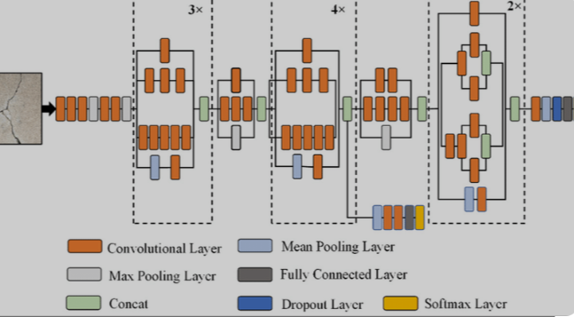

# AI-Image-Classifier

## About
We have built an AI-Image classifier app .This app successfully classifies images as Real or AI-generated fake image. The app also shows the p-scores of the classification with respect to it being real. This feature not only retains the transparency of the result but also carries important information. Images with borderline p-scores around 0.5 signifies that the image maybe a blend. 

For example tests against real images edited using AI-features resulted in p-values in range 0.6-0.8 approximately which says that it is primarily real but has some synthetic features to it in contrast to purely real phtotgraphs where p-score is usually above 0.95. 

## Architecture used:
So we had looked through various architectures for this specific task and decided to use pretrained models to achieve state-of-art performance.
So we decided to take-up pretarined models built on the purpose of image classification like VGG-16 and InceptionV3. We froze the base CNN layers, added fully connected layers at the output side for binary classification. We also had some binary imbalance in our scrapped data so we implemented SMOTE to make the training unbiased. Finally we decided to go with InceptionV3.

### why InceptionV3 over VGG-16 and others?
One of the main reasons is the use of Inception modules which can perform convolutions with multiple filter-sizes simultaneously which provides for better generalizations. It also uses auxiliary classifiers which prevent overfitting. It also uses factorization to reduce the no. of parameters and hence improve computational costs.


#### Architecture of InceptionV3



## Project Working Video

[▶️ Watch Demo Video](Demo_video.mp4)

## How to get started 🚀
First, we need to have all the requirements before hosting into our local system.
### Requirements:
+  git installed in your system
+  python environment setup (v3.0 or more preferred)
### Steps to Follow:
+ Clone the Repository
```bash
git clone https://github.com/Atul-04/Ai-Image-Classifier.git
```
+ Open the terminal in the folder where all these files are saved
+ Use the command to run the app
```bash
streamlit run app.py
```
+ A local host server will be active and its URL will be given in the terminal, go to that and fact-check the image like a cop.

## How to use this App 🤩
+ There are two theme modes provided: Light and Dark.

+ Two options are provided: 
    + Upload from Files (local system)
    + By entering the URL of the image

+ After Images are fetched from the data it will shown. (as per the video)
+ Now click on the button **Produce Result**. It will give the details of the image whether it's Fake 🤥 or Real 😺 with the probability of how real is this image.
  
## Improvements 😎
+ Our App depends on the order
> app.py > main.py > inceptionv3f.weights.h5

We can further improve our project by removing the dependency of the weights file.
+ In the dev section we can implement some more interesting UI elements like font size, font weights, and colors, etc.

### Happy Contributing 😁!! 

